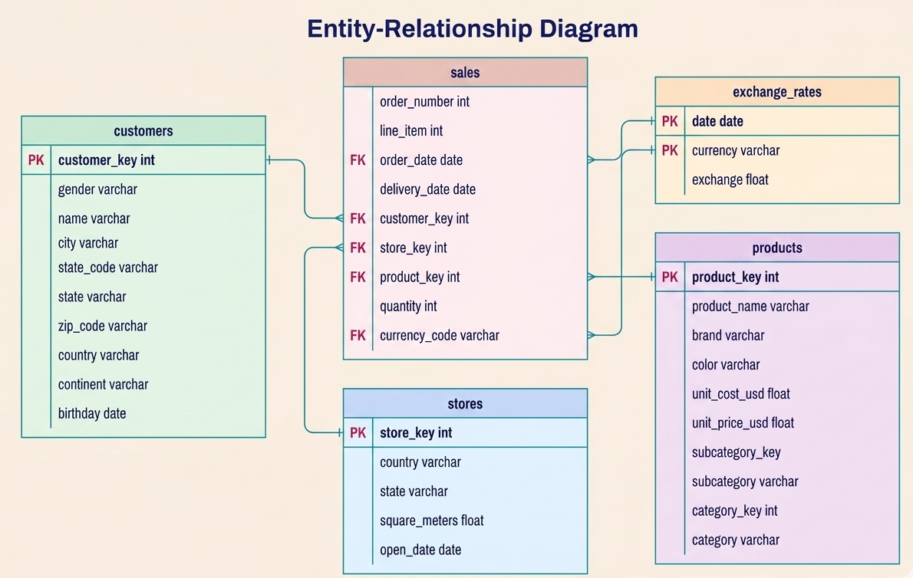
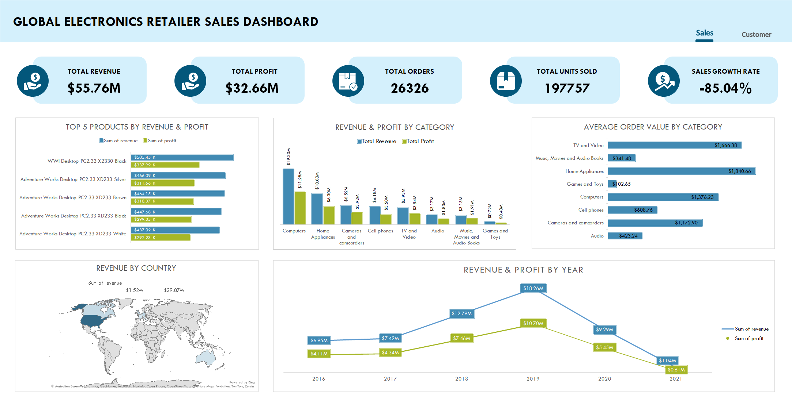
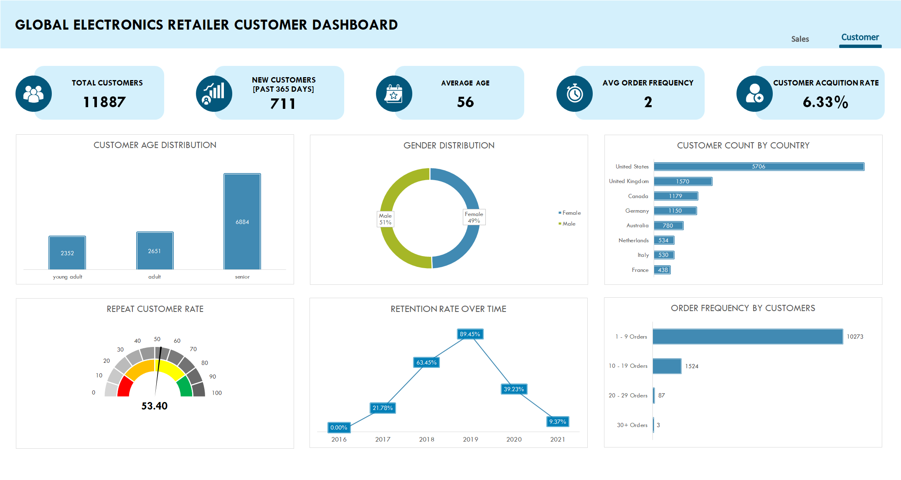

# Global Electronics Retailer: Sales & Customer Insights

An end to end data analytics project that transforms global electronics retail data into business insights using Python, SQL Server, and Excel.

## Project overview

This project analyses sales transactions, customer behaviour, products, stores, and exchange rates for a fictional global electronics retailer. The goal is to identify revenue drivers, customer trends, and market opportunities through a reproducible data workflow and an interactive Excel dashboard.

## Business questions

- Which products, categories, and markets generate the most revenue and profit?
- How do sales and profit change over time?
- What does the customer base look like by age, gender, and geography?
- How strong are repeat purchase and retention trends?
- Which areas offer the greatest opportunity for growth?

## Tools used

- **Python and Jupyter Notebook** — data cleaning
- **SQL Server and SQL** — data storage and analysis
- **Microsoft Excel** — interactive dashboard and reporting

## Project workflow

1. Clean raw customer, product, sales, store, and exchange-rate data.
2. Load cleaned datasets into SQL Server.
3. Create an analysis-ready dataset with SQL.
4. Build sales and customer dashboards in Excel.

## Repository guide

- [`[01] ETL`](./%5B01%5D%20ETL/) — source data, cleaned data, notebooks, and loading scripts
- [`[02] SQL`](./%5B02%5D%20SQL/) — SQL analysis query
- [`[03] Excel Dashboard`](./%5B03%5D%20Excel%20Dashboard/) — dashboard workbook and metric documentation

## Data structure

The analysis combines five related tables containing **62,885 sales records**.

| Table | Description |
|---|---|
| `customers` | Customer demographics and location details |
| `sales` | Order-level transaction records |
| `products` | Product, brand, category, cost, and price information |
| `stores` | Store location, size, and opening-date details |
| `exchange_rates` | Daily currency conversion rates |

The `sales` table is the central fact table and links to customers, products, stores, and exchange rates.

## Sales performance

### Key metrics

| Metric | Result |
|---|---:|
| Total revenue | $55.76M |
| Total profit | $32.66M |
| Total orders | 26,326 |
| Total units sold | 197,757 |

### Key findings

- **Computers** are the leading category, generating approximately **$19.3M** in revenue.
- The **WWI Desktop PC2.33 X2330 Black** is the highest-revenue product, delivering approximately **$505K** in revenue.
- **Home appliances** have the highest average order value at approximately **$1.84K**.
- The **United States** is the largest market, contributing approximately **$29.87M** in revenue.
- Revenue peaked in **2019** at approximately **$18.26M**.
- The 2021 figures should be interpreted carefully because the available data is incomplete.

## Customer insights

### Key metrics

| Metric | Result |
|---|---:|
| Total customers | 11,887 |
| New customers in the past 365 days | 711 |
| Average customer age | 56 years |
| Average order frequency | 2 orders |
| Customer acquisition rate | 6.33% |
| Repeat customer rate | 53.40% |

### Key findings

- Seniors represent the largest customer age group, followed by adults and young adults.
- The gender split is balanced: **51% male** and **49% female**.
- The United States has the largest customer base with **5,706** customers.
- More than **10,000 customers** place between 1 and 9 orders, indicating a major opportunity to encourage repeat purchases.
- Retention peaked at **89.45% in 2019** and declined in later years; the incomplete 2021 data should be interpreted with caution.